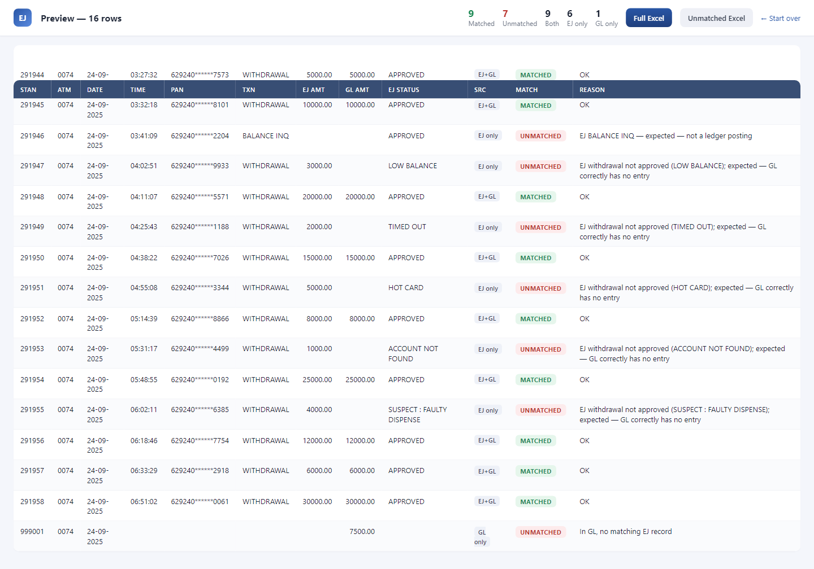
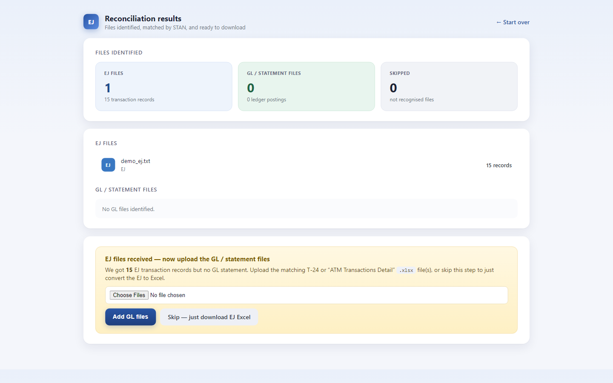
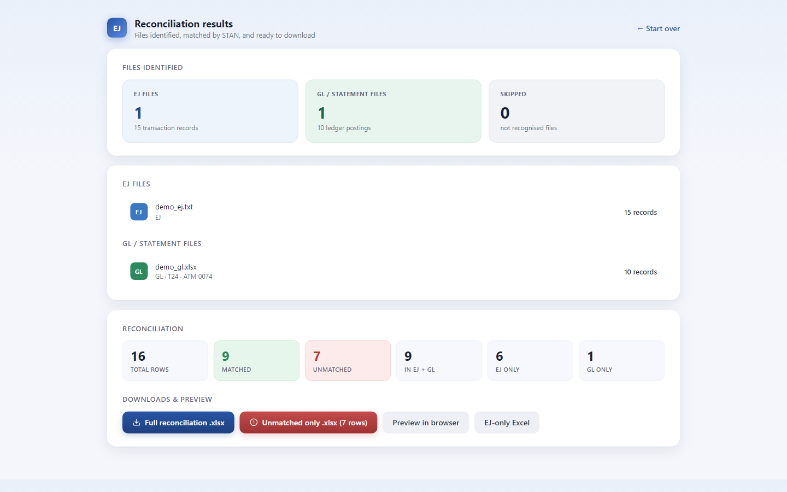
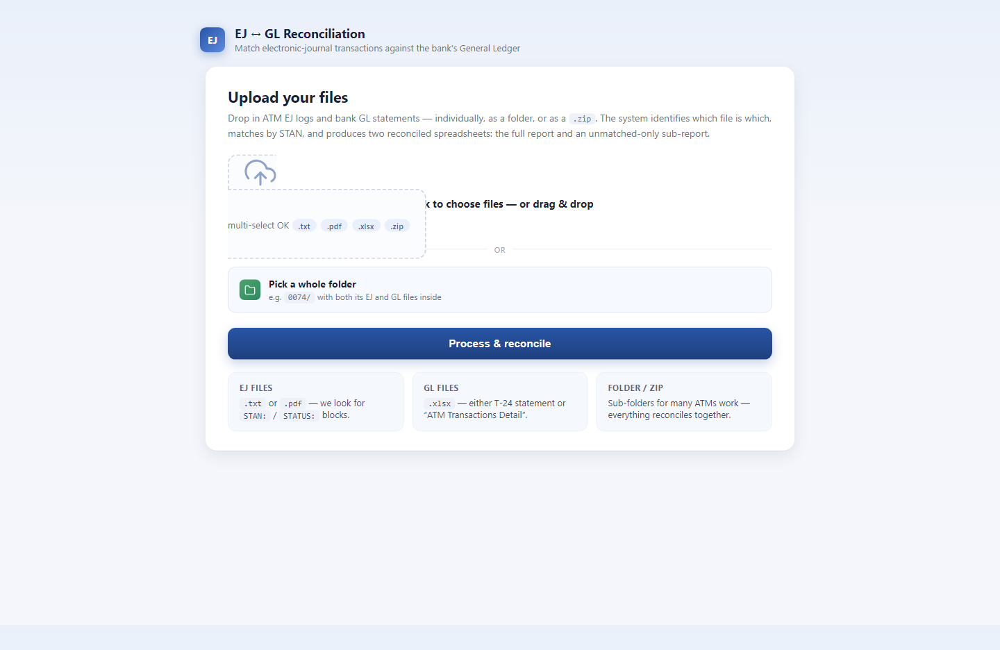

# ATM Electronic Journal Parser and GL Reconciliation

> Parses raw ATM electronic journal logs and reconciles transactions against general ledger statements.

Built by **[Muhammad Tanveer](https://www.linkedin.com/in/muhammad-tanveer-advenno/)** - Full-Stack AI Automation Engineer.

[](#source-code-and-access) [](https://github.com/haddindeve)

## Contents

- [The problem](#the-problem)
- [The approach](#the-approach)
- [Architecture](#architecture)
- [Tech stack](#tech-stack)
- [Key capabilities](#key-capabilities)
- [Selected code](#selected-code)
- [Screenshots](#screenshots)
- [Results](#results)
- [FAQ](#faq)
- [Source code and access](#source-code-and-access)
- [About the engineer](#about-the-engineer)
- [Related projects](#related-projects)

## The problem

Reconciling ATM activity means reading electronic journal logs - unstructured, machine-specific text - and matching them by hand against general ledger entries. It is slow, and the errors it produces are financial ones.

## The approach

A parser that turns raw EJ text into structured transaction records, then a reconciliation stage that matches those records against GL statements and reports what does not agree. The parser is tolerant of the format variation that makes these logs awkward to process.

## Architecture

| Component | Responsibility |
| --- | --- |
| **EJ parser** | Raw journal text to structured transactions |
| **Normalisation** | Handling of machine and format variation |
| **Reconciliation** | Matching against general ledger entries |
| **Reporting** | Exception and discrepancy output |

## Tech stack

| Layer | Technology |
| --- | --- |
| Language | Python |
| Parsing | Tolerant text parsing of EJ formats |
| Output | Structured reconciliation reports |

## Key capabilities

- Electronic journal parsing
- Format-variation tolerance
- Automated GL matching
- Discrepancy reporting

## Selected code

From `ej_parser/__init__.py` in the private repository:

```python
"""EJ log -> Excel conversion package."""

__author__ = "maaz-gobi"

from .parser import Record, parse_file, parse_records, extract_text, categorise
from .excel_writer import build_workbook

__all__ = [
    "Record",
    "parse_file",
    "parse_records",
    "extract_text",
    "categorise",
    "build_workbook",
]
```

## Screenshots









## Results

- Manual log reading replaced by structured extraction
- Discrepancies surfaced as exceptions rather than found by inspection

## FAQ

### What is an ATM electronic journal?

The machine's own transaction log - a plain-text record of every operation, with format varying by machine and vendor.

### What does reconciliation produce?

A report of matched transactions and, more importantly, the exceptions that do not agree with the ledger.

### Why is parsing hard?

EJ output is unstructured and varies between machines, so the parser has to tolerate format differences.

### Is the code available?

Private repository; access on request.

## Source code and access

This repository is the public case study for **ATM Electronic Journal Parser and GL Reconciliation**. The full implementation - application code, database schema, tests and deployment configuration - lives in a **private repository** on this account, alongside the rest of the work shown here.

Source access can be arranged for hiring conversations, technical review or client due diligence. The quickest route is a short message on [LinkedIn](https://www.linkedin.com/in/muhammad-tanveer-advenno/) or an email to [mtanveertahir6666@gmail.com](mailto:mtanveertahir6666@gmail.com).

## About the engineer

**Muhammad Tanveer - Full-Stack AI Automation Engineer**

Full-stack AI automation engineer. I build agentic systems, browser and workflow automation, RAG pipelines and the production web platforms they run on - from Rust and Python services to Next.js dashboards and PHP/MySQL business systems.

- GitHub: [haddindeve](https://github.com/haddindeve)
- LinkedIn: [Muhammad Tanveer](https://www.linkedin.com/in/muhammad-tanveer-advenno/)
- Email: [mtanveertahir6666@gmail.com](mailto:mtanveertahir6666@gmail.com)
- Location: Pakistan

## Related projects

- [Exporter Lead Generator - AI B2B Buyer Discovery](https://github.com/haddindeve/exporter-lead-generator-ai)
- [AI Sales Agent - Automated Lead Generation and Outreach](https://github.com/haddindeve/advenno-ai-sales-agent)
- [SMIP - Smart Manufacturing Intelligence Platform](https://github.com/haddindeve/smip-ai-iot-manufacturing-platform)
- [ACIP - AI Content Intelligence Platform](https://github.com/haddindeve/bloggen-ai-content-platform)
- [Doctern - AI Document OCR and Table Extraction](https://github.com/haddindeve/doctern-document-ocr-ai)
- [AI Lab Support and Campus Routing Assistant](https://github.com/haddindeve/ai-lab-support-campus-routing)

---

<sub>ATM Electronic Journal Parser and GL Reconciliation - case study by Muhammad Tanveer - Full-Stack AI Automation Engineer. Keywords: ATM electronic journal parser, EJ log parsing, GL reconciliation, banking reconciliation automation, transaction matching, financial data parsing.</sub>